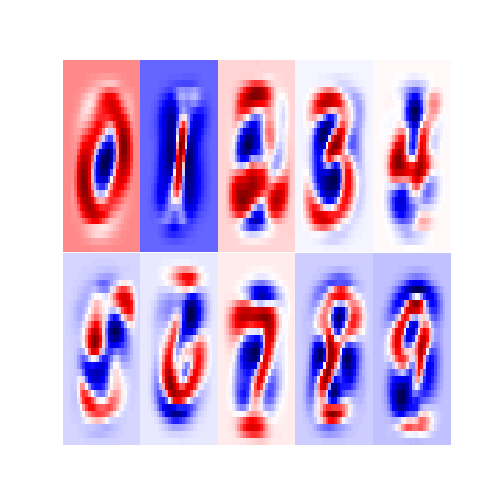

# Naive Bayes
Each datapoint is regarded as a 28 by 28 pixel greyscale image of handwritten digits ($\{0, 1, \dots, 9 \}$), and a classification label
indicating the true digit. Thus we can state the problem as follows: Given the image of a written digit, what is the true digit meant to
be? That is, given datapoint $\mathbf{x}$, what is its true label? Our first approach will be Bayesian. We will also binzarize the pixels values,
using $> 0.5$ as the cut-off.


Given input space $\mathbf{\chi} = \{0,1 \}^{784}$ and target space $\mathcal{Y}=\{0,1, \dots, 9\}$ let $c \in \mathcal{Y}$ where the distribution of target $c$ is given by $p(c | \pi) = \pi_c$. Hence for a given image $\mathbf{x}$, and class $c$, the joint density is given by
$$
p( \mathbf{x}, c \, | \, \mathbf{\theta}, \pi) = \pi_c\prod_{d=1}^{784}\theta_{cd}^{x_d}(1-\theta_{cd})^{1-x_d}
$$

For a given class/label $c$ and a pixel $d$. We model the pixel state (white or black) with the Bernoulli likelihood:
$$
p(x_d \, | \, c, \theta_{cd}) = \theta_{cd}^{x_d}(1-\theta_{cd})^{1-x_d}
$$
it follows that $\theta_{cd}=P\{x_d = 1 \, | \, c, \theta_{cd} \}$ for a single example. Let $\mathbf{y}$ be the $N=$ 60,000-dimensional vector of predictions for the dataset. Then we may estimate the conditional pixel means $\theta_{cd}$ by maximum likelihood estimation as follows,
$$
\begin{aligned}
\widehat{\theta}_{cd} &:= \, arg\,\, \max_{\theta_{cd}} \, \prod_{n=1}^N \pi_c\prod_{d=1}^{784}\theta_{cd}^{x_d^{(n)}}(1-\theta_{cd})^{1-x_d^{(n)}} \\
\\
&= \, arg\,\, \max_{\theta_{cd}} \, \sum_{n=1}^N\bigg(log \, \pi_c  + \sum_{d=1}^{784}x_d^{(n)}log \, \theta_{cd}^{(n)} + (1-x_d^{(n)})log \, (1-\theta_{cd}^{(n)}) \bigg) 
\end{aligned}
$$
which is the solution to the likelihood equation:
$$
\sum_{n=1}^N\mathbb{1}\{y^{(n)}=c \}\bigg(x_d^{(n)}(1-\theta_{cd}) - (1-x_d^{(n)})\theta_{cd} \bigg) = 0
$$
and so,
$$
\widehat{\theta}_{cd, MLE} = \frac{\sum_{n=1}^N\mathbb1\{y^{(n)}=c\}x_d^{(n)}}{\sum_{n=1}^N\mathbb1\{y^{(n)}=c\}}
$$
which is to be interpreted as the ratio of the number of examples with the dth pixel activated in class $c$ to the total number of examples of class $c$, which is a natural result for the MLE. However, this estimator can be problematic if there are no examples of a particular class within the
dataset (thus we have 0 in the denominator of our estimator), or the pixel value is 1 in every example in dataset (then the estimator is equal to 1).

Consider instead the maximum aposteriori estimator with a $Beta(\alpha, \beta)$ prior, given by,
$$
\begin{aligned}
  \widehat{\theta}_{cd, MAP} &:= \, arg \,\, \max_{\theta_{cd}} P\{\theta_{cd} \, | \, x_d, c \} \\
  \\
  &= \, arg \,\, \max_{\theta_{cd}} \, \prod_{n=1}^N \pi_c\prod_{d=1}^{784}\theta_{cd}^{x_d^{(n)}}(1-\theta_{cd})^{1-x_d^{(n)}}  \times Beta(\alpha, \beta) \\
  \\
  &= \, arg \,\, \max_{\theta_{cd}} \,  \bigg(\theta_{cd}^{\sum_{n=1}^N\mathbb1\{y^{(n)}=c\}x_d^{(n)} + (\alpha - 1)}(1-\theta_{cd})^{\sum_{n=1}^N\mathbb1\{y^{(n)}=c\}(1-x_d^{(n)}) + (\beta - 1)}\bigg)
\end{aligned}
$$
where the expression inside parenthesis on the last line may be recognized as $Beta(\sum_{n=1}^N\mathbb1\{y^{(n)}=c\}x_d^{(n)} + \alpha \, , \, \sum_{n=1}^N\mathbb1\{y^{(n)}=c\}(1-x_d^{(n)}) + \beta)$ which for $\alpha, \beta > 1$ (hence unimodal),  has mode:
$$
\frac{\sum_{n=1}^N\mathbb1\{y^{(n)}=c\}x_d^{(n)} + \alpha - 1}{\sum_{n=1}^N\mathbb1\{y^{(n)}=c\} + \alpha + \beta - 2}
$$
In particular if we let $\alpha = \beta = 2$ (symmetric about $1/2$) we have,
$$
\widehat{\theta}_{cd, MAP} = \frac{\sum_{n=1}^N\mathbb1\{y^{(n)}=c\}x_d^{(n)} + 1}{\sum_{n=1}^N\mathbb1\{y^{(n)}=c\} + 2}
$$
This is known as "Laplacian smoothing". Then the $784 \times 10$ matrix $\widehat{\mathbf{\theta}}_{MAP}$ will have entry $c,d$ given as derived above.

Next we will load in the MNIST dataset from the loader provided in [http://yann.lecun.com/exdb/mnist/].
```{r}
source('loadMNIST.R')
load_mnist()
train$x <- ifelse(train$x > 0.5, 1, 0) # binarize pixels
test$x <- ifelse(test$x > 0.5, 1, 0)
```
Utilizing the derived MAP estimates for the pixel means we fit $\mathbf{\theta}$ to the training set:
```{r}
pixel_means <- function(data) {
  m <- matrix(0, nrow=784, ncol=10)
  for (i in 0:9) {
    class_set <- data$x[data$y == i, ]
    theta.c <- (colSums(class_set) + 1) / (nrow(class_set) + 2)
    m[ ,i+1] <- theta.c
  }
  m
}
theta.hat <- pixel_means(train)
```

```{r echo=FALSE, fig.align='center', fig.height=3, fig.width=5, fig.cap="\\label{fig:figs}Condition Pixel Means"}
show_digit <- function(arr784, col=gray((0:255)/255), ...) {
  image(matrix(arr784, nrow=28)[,28:1], col=col, ...)
}
par(mfrow=c(2, 5))
par(mar=c(0, 0, 3, 0), xaxs='i', yaxs='i')
for (c in 1:10) {
  show_digit(theta.hat[,c], xaxt='n', yaxt='n')
}
```
Above are the learned weights for $\widehat{\mathbf{\theta}}_{MAP}$.

For a single training image we have the log-likelihood as,
$$
\begin{aligned}
log \, p(c \,|\, \mathbf{x}, \mathbf{\theta}, \pi) &= log \bigg\{\frac{\pi_c \, p(\mathbf{x} \, | \, c, \theta, \pi)}{\sum_{c'=0}^9\pi_{c'}p(\mathbf{x} \, | \, c', \theta, \pi)} \bigg\} \\
\\
&\propto log \, \big(\pi_c \, p(\mathbf{x} \, | \, c, \theta, \pi) \big) \\
\\
&=log \bigg\{\pi_c\prod_{d=1}^{784}\theta_{cd}^{x_d}(1-\theta_{cd})^{1-x_d} \bigg\} \\
\\
&= log\pi_c + \sum_{d=1}^{784}\big(x_d log\, \theta_{cd} + (1-x_d)log (1-\theta_{cd}) \big)
\end{aligned}
$$
Let $\pi_c = \frac{1}{10}$ and let us find the average log-likelihood per datapoint ($\frac{1}{N}\sum_{i=1}^Nlog \, p(c_i \,|\, x_i, \theta, \pi)$),
\vspace{12pt}
```{r}
loglik <- function(datapoint, prior, theta) {
  image <- datapoint$x; class <- datapoint$y
  r <- log(prior) + sum(image * log(theta[,class+1]) +
                          (1-image) * log(1-theta[,class+1]))
  r
}

ll <- c()
for (d in 1:nrow(train$x)) {
  datapoint <- list(x=train$x[d,], y=train$y[d])
  ll <- c(ll, loglik(datapoint, 1/10, theta.hat))
}
mean(ll)
```
Thus we have found that $\frac{1}{N}\sum_{i=1}^Nlog \, p(c_i \,|\, x_i, \theta, \pi) =$ `r mean(ll)`. Next we will compute the accuracy; defined as the fraction of examples where the true class $t = arg \, \max_c p(c \,|\, \mathbf{x}, \mathbf{\theta}, \pi)$. 
\vspace{12pt}
```{r}
bayes_estimate <- function(image) {
  logliks <- c()
  for (i in 0:9) {
    datapoint <- list(x=image, y=i)
    logliks <- c(logliks, loglik(datapoint, 1/10, theta.hat))
  }
  which.max(logliks) - 1
}
```
```{r}
train.estimates <- numeric(nrow(train$x))
test.estimates <- numeric(nrow(test$x))
for (i in 1:nrow(train$x)) {
  train.estimates[i] <- bayes_estimate(train$x[i,])
}
for (i in 1:nrow(test$x)) {
  test.estimates[i] <- bayes_estimate(test$x[i,])
}
accuracy.train <- mean(train$y == train.estimates)
accuracy.test <- mean(test$y == test.estimates)
accuracy.train
accuracy.test
```
The Naive Bayes approach gives a training data classification accuracy of `r accuracy.train`; and a test accuracy of `r accuracy.test`.

Again, the Naive Bayes assumption is that within each class, distinct pixel values are independent (i.e. $x_i \perp x_j \,| \, c$, $i, j \in \{1, \dots, 784 \}$, $i \neq j$). As such we have, $p(\mathbf{x} \, | \, c, \theta_c) = \prod_{d=1}^{784}\theta_{cd}^{x_d}(1-\theta_{cd})^{1-x_d}$. However, if we marginalize over $c$, and instead consider an assumption of unconditional independence (i.e. $x_i \perp x_j$, $i \neq j$) then things break down. Observing pixels in one region of the image would lead one to expect pixels in the same region of another image of the same class, suggesting a strong correlation between elements of the feature space.

To demonstrate the effects of our assumptions we randomly sample from the marginal distribution $p(\mathbb{x} \, | \, \mathbb{\theta}, \pi)$,
using our trained model.
\vspace{12pt}
```{r}
samples <- matrix(0, nrow=784, ncol=10)
for (i in 1:10) {
  c <- sample(0:9, 1)
  theta.c <- theta.hat[,c+1]
  samp <- numeric(784)
  for (j in 1:784) {
    samp[j] <- sample(c(0,1), 1, prob = c(1-theta.c[j], theta.c[j]))
  }
  samples[,i] <- samp
}
```
```{r, echo=FALSE, fig.align='center', fig.height=3, fig.width=5, fig.cap="\\label{fig:figs}Random Samples From Model"}
par(mfrow=c(2, 5))
par(mar=c(0, 0, 3, 0), xaxs='i', yaxs='i')
for (c in 1:10) {
  show_digit(samples[,c], xaxt='n', yaxt='n')
}
```
It appears as if the Naive Bayes model may be too simplistic. The conditional independence assumption could be too strong.

Here we consider how the Naive Bayes models handles missing data. Say we are given the top half of an image and wish to find the marginal distribution of a single pixel in the bottom half. Then let $B = \{392, \dots , 784 \}$
$$
\begin{aligned}
  p(x_{i\in B} \, | \, \mathbb{x}_{top} \,, \mathbb{\theta}, \pi) & = \sum_cp(x_{i \in B} \, |c\,, \mathbb{x}_{top}\,,\theta, \pi)\frac{p(\mathbb{x}_{top} \, | \, c, \theta, \pi)p(c \, | \, \pi)}{\sum_{c'}p(\mathbb{x}_{top} \, | \, c, \theta, \pi)p(c \, | \, \pi)} \\ 
  \\
  &= \sum_cp(x_{i \in B} \, |c\,\,,\theta, \pi)\frac{p(\mathbb{x}_{top} \, | \, c, \theta, \pi)p(c \, | \, \pi)}{\sum_{c'}p(\mathbb{x}_{top} \, | \, c, \theta, \pi)p(c \, | \, \pi)}
\end{aligned}
$$
futhermore, if we continue to assume that $p(c \, | \, \pi)$ is the same for all $c$, then the expression simplifies further to $S^{-1}\sum_cp(x_{i \in B} \, |c\,\,,\theta, \pi)p(\mathbb{x}_{top} \, | \, c, \theta, \pi)$ where $S$ is the sum in the denomitor of the expression above.
From the results derived above, we will plot the top half the image concatenated with the marginal distribution over each pixel in the bottom half.

```{r}
marginal_means <- function(image) {
  marginal <- c()
  for (i in 393:784) {
    denom <- 0
    tmp <- numeric(10)
    for (j in 1:10) {
      bottom_pix <- dbinom(image[i], 1, theta.hat[i, j])
      top_probs <- prod(dbinom(image[1:392], 1, theta.hat[1:392,j]))
      denom <- denom + top_probs
      tmp[j] <- bottom_pix * top_probs
    }
    marginal <- c(marginal, 1-(sum(tmp) / denom))
  }
  new_image <- c(image[1:392], marginal)
  new_image
  }
```
```{r, echo=FALSE, fig.align='center', fig.height=4, fig.width=5, fig.cap="\\label{fig:figs}Marginal distribution of a single pixel given top half"}
par(mfrow=c(4, 5))
par(mar=c(0, 0, 3, 0), xaxs='i', yaxs='i')
for (i in 1:20) {
  image <- c(train$x[i, 1:392], rep(0, 392))
  new_image <- marginal_means(image)
  show_digit(new_image, xaxt='n', yaxt='n')
}
```
# Logistic Regression

In this section we will compare our previous results with a multiclass logistic regression model.
$$
p(c \, | \, \mathbf{x}, \mathbf{w}) = \frac{exp(\mathbf{w}_c^T\mathbf{x})}{\sum_{c\prime=0}^{9}exp(\mathbf{w}_{c\prime}^T\mathbf{x})}
$$
which is the softmax function, which we denote by $S_c$.The model has $784 \times 10=7840$ wieght parameters (thus we supress a bias parameter here).
We can express the log-softmax as $\mathbf{w}_c^T\mathbf{x} - log\bigg(\sum_{c\prime=0}^{9}exp(\mathbf{w}_{c\prime}^T\mathbf{x}) \bigg)$. For the batch of $N =60,000$ training examples the predictive log-likelihood is then given by $log \mathcal{L}(\mathbf{w}) = \sum_{n=1}^{N}\bigg(\mathbf{w}_c^T\mathbf{x} - log\bigg(\sum_{c\prime=0}^{9}exp(\mathbf{w}_{c\prime}^T\mathbf{x}) \bigg)\bigg)$. To arrive at the gradient, we compute the partial derivatives with respect to each paramter:
$$
\begin{aligned}
\frac{\partial log \mathcal{L}(\mathbf{w})}{\partial w_c^{(d)}} &= \frac{\partial}{\partial w_c^{(d)}}\sum_{n=1}^Nw_{c'}^Tx_n - \frac{\partial}{\partial w_c^{(d)}}\sum_{n=1}^Nlog \sum_{c'=0}^9 exp(w_{c'}^Tx_n) \\
\\
&= \sum_{n=1}^N\mathbb{1}\{y_n = c \}x_n^{(d)} - \sum_{n=1}^N\frac{\sum_{c'=0}^9 exp(w_{c'}^Tx_n)\mathbb{1}\{y_n=c\}x_n^{(d)}}{\sum_{c'=0}^9 exp(w_{y_n}^Tx_n)} \\
\\
&= \sum_{n=1}^N \bigg(\mathbb{1}\{y_n=c\}x_n^{(d)}-S_cx_n^{(d)} \bigg)
\end{aligned}
$$
for $c = 0, 2, \dots, 9$ and $d = 1, \dots , 784$. However, there is a more intuitive interpretation. If we consider the vector of probabilities (of being in each of the 10 classes) for image $i$, $\widehat{\mathbf{y}}_i =[\hat{y}_i^{(1)}, \dots, \hat{y}_i^{(10)}]$ given by the output of the softmax activation function, then we may arrive at the useful representation of a single observation:
$$
\begin{aligned}
P(\widehat{\mathbf{y}}_i) &= \prod_{j=1}^{10}\hat{y}_j^{y_j} \\
\\
&= (1)\times(1) \times \dotsi \times \hat{y}_k^{1} \times \dotsi \times (1)
\end{aligned}
$$
Thus, as we have $N=60000$ examples/training images, we find the log-likelihood to be
$$
\sum_{n=1}^NlogP(\widehat{\mathbf{y}}_1, \dots, \widehat{\mathbf{y}}_N) = \sum_{n=1}^N\sum_{j=1}^{10}y_jlog\hat{y}_j
$$
Below we will implement a gradient descent procedure to maximize our predictive log-likelihood. However, this is equivalent to minimizing the negative log-likelihood: $-\sum_{n=1}^N\sum_{j=1}^{10}y_jlog\hat{y}_j$ which is defined to be the cross entropy. Thus we shall use this as our cost function. For efficiency and ease of computation we make use of the tensorflow framework.
```{r include=FALSE}
library(tensorflow)
library(reticulate)
datasets <- tf$contrib$learn$datasets
mnist <- datasets$mnist$read_data_sets("MNIST-data", one_hot = TRUE)
train_images <- mnist$train$images
train_labels <- mnist$train$labels
test_images <- mnist$test$images
test_labels <- mnist$test$labels
```

```{python}
import tensorflow as tf
import numpy as np
import matplotlib.pyplot as plt

train_epochs = 100
# tf Graph Input
x = tf.placeholder(tf.float32, [None, 784])
y = tf.placeholder(tf.float32, [None, 10])

# Set model weights
W = tf.Variable(tf.zeros([784, 10]))

model = tf.nn.softmax(tf.matmul(x, W))
cost = tf.reduce_mean(-tf.reduce_sum(y * tf.log(model), reduction_indices=1))

eta = 0.5
grad_W = tf.gradients(xs = W, ys = cost)
update = W.assign(W - tf.scalar_mul(eta, grad_W[0]))
with tf.Session() as sess:
  sess.run(tf.global_variables_initializer())
  ll_sum = 0
  for epoch in range(train_epochs):
    u, c = sess.run([update, cost], feed_dict = {x: r.train_images, y: r.train_labels})
    ll_sum += c
  correct_prediction = tf.equal(tf.argmax(model, 1), tf.argmax(y, 1))
  accuracy = tf.reduce_mean(tf.cast(correct_prediction, tf.float32))
  sess.run(accuracy, feed_dict={x: r.train_images, y: r.train_labels})
  sess.run(accuracy, feed_dict={x: r.test_images, y: r.test_labels})
  print(ll_sum/train_epochs)
```
```{r pressure, echo=FALSE, fig.align='center' ,fig.cap="Learned Weights", out.width="50%"}

```
We have achieved an accuracy of about 0.89 on the training data and about 0.90 on the test data. The average log-likelihood was found to be about -0.565. Compared to Naive Bayes this is an improvement. The gradient descent method could be further optimized by using mini-batch learning. The comparison to Naive Bayes loosely demonstrates the trade-offs between model complexity and accuracy. Plots of learned paramters are contained in figure 4.
